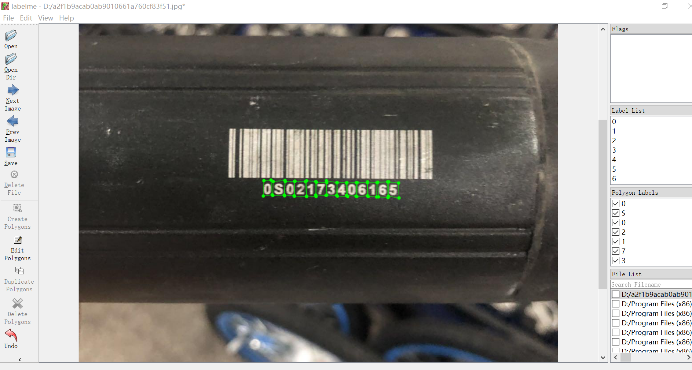
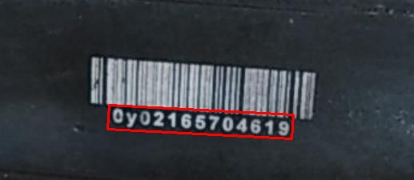

# 如何利用CRAFT训练属于自己文本检测数据集的模型
本项目旨在以CRAFT提供的预训练模型为基础，进行迁移学习以用于检测自己数据集中的文本。  
[[CRAFT论文]](https://arxiv.org/abs/1904.01941)
[[代码]](https://github.com/CommissarMa/pytorch-CRAFT)  
[[论文中文解读]](https://github.com/CommissarMa/Awesome_CV_papers/blob/master/Text_Related/cvpr2019_CRAFT/cvpr2019_CRAFT.md)

## 1. 直接使用CRAFT的预训练模型测试自己的文本图像
1. 下载CRAFT预训练权重文件[[craft_mlt_25k.pth]](https://pan.baidu.com/s/1oinKoVnIMP017hc-1yX_CQ)(提取码：3bgk)，并将该权重文件放入pretrained目录下。
2. 将需要检测的图像全部放入imgs目录下。
3. 运行代码:  
    ```
    python test.py --trained_model ./pretrained/craft_mlt_25k.pth
    ```
4. 检测的结果将保存在result文件夹中供查看。

## 2. 在自己的数据集上训练CRAFT，迁移学习
1. 标注自己的数据集，使用标注工具[[labelme]](https://github.com/wkentaro/labelme)，我们进行字符级别的标注，即对每个字符顺时针标注4个点构成一个多边形框，如下图所示：
  
然后我们给这个多边形框标注对应的字符，方便之后如果要做文本识别时使用。
2. 假设我们数据集的根目录是blw，目录中有图片blw_1.jpg和标注blw_1.json两种文件[[参考数据集：提取码6q33]](https://pan.baidu.com/s/10FO2Y9tMPcrjmBoTbPJlXw)，此时我们运行generate_score_map.py(注意修改main函数中的name = 你的根目录名称)，运行完之后，你的目录中除了上面两种.jpg和.json外，会多了blw_region_1.npy和blw_affinity_1.npy两种，分别对应了CRAFT中的region_map和affinity_map。然后我们建立一个根目录data，并将四种文件分别放入对应的子目录，如下所示：  
    + data：
        + affinity：blw_affinity_1.npy
        + anno：blw_1.json
        + img：blw_1.jpg
        + region：blw_region_1.npy  
    
    此时我们自己的数据集就准备好了。
3. 运行train.py(注意修改main函数中的参数设置)，训练好的模型默认存放在./models中。

## 3. 使用得到的新模型来测试自己的文本图像
这里我们会遇到一个问题，在训练时，每个epoch之后我们都会保持一个模型，那究竟应该使用哪个呢？  
其实这也没有一个标准答案，选不同的都试试看测试效果，然后挑一个比较好的即可。  
具体的步骤与1差不多：将models文件夹中的权重，比如：[[100.pth]](https://pan.baidu.com/s/1Na5hA2-RXMovIa6J7aJzhw )(提取码:1tmc)放入./pretrained中，然后运行代码：  
```
python test.py --trained_model ./pretrained/100.pth
```
检测的结果将保存在result文件夹中供查看，可以发现检测的效果相比直接使用预训练模型有了一定的提升！  
 

## 4. 将标注的点透视变换成水平文本框(供文本识别使用)
```
run divide_text_region_from_gt.py
```
注意修改main函数中的参数配置。

